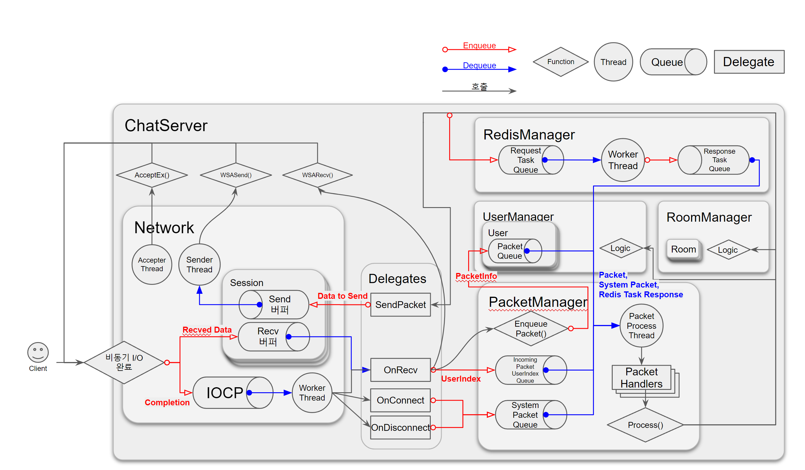
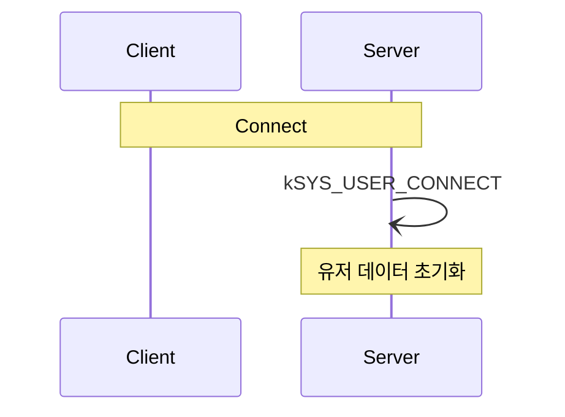
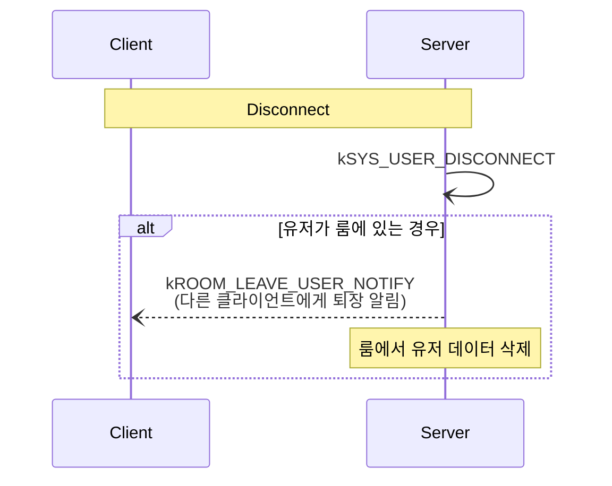
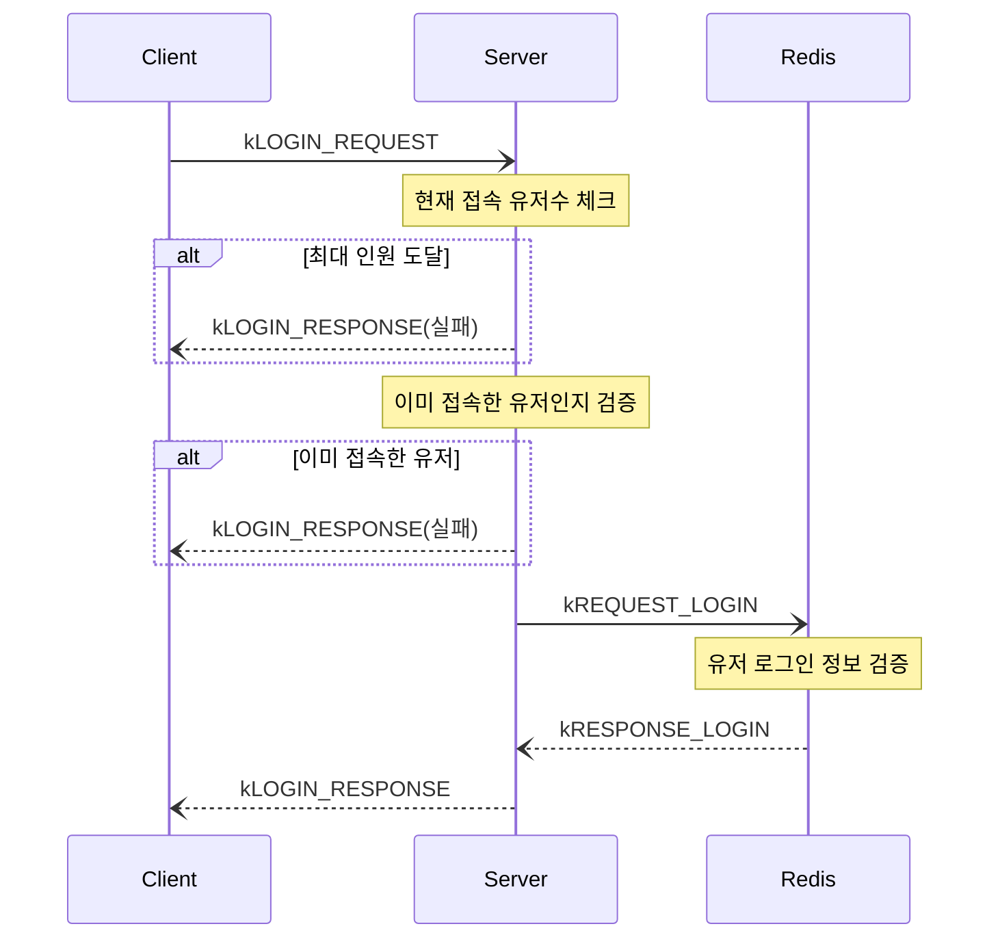
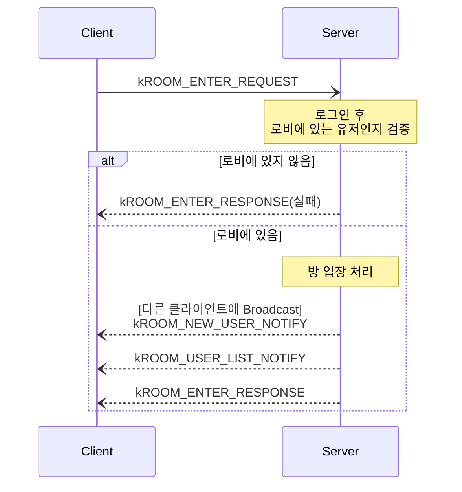
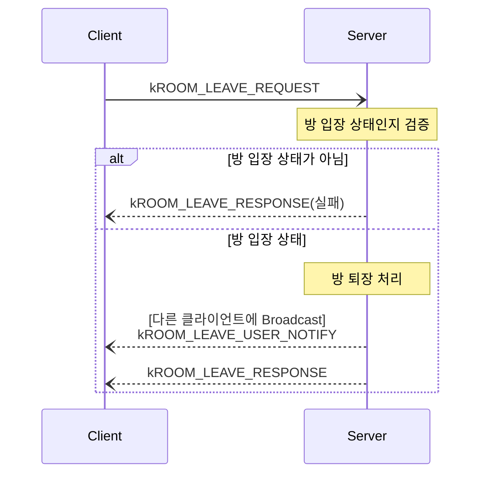
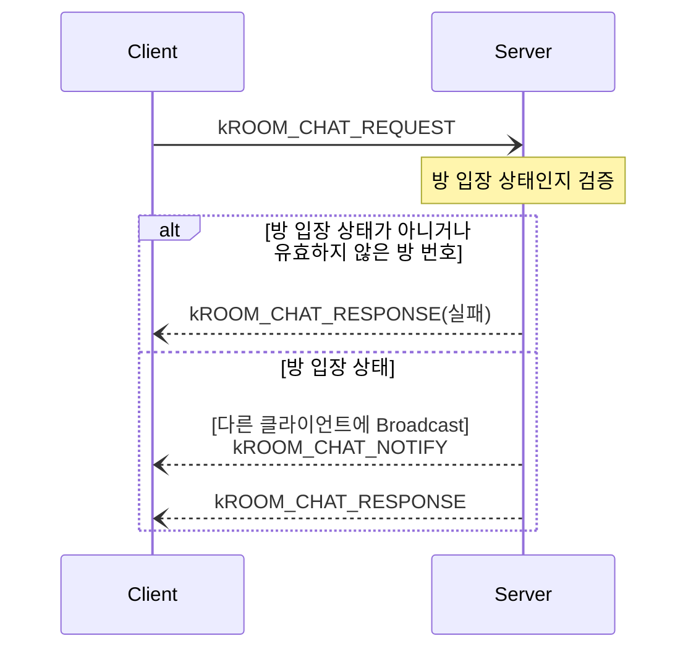

# 💬 IOCP Chatting Server

**IOCP 모델 기반 멀티스레드 채팅 서버**

---

# :computer: 구현 내용

- **IOCP 모델 기반** 멀티스레드 소켓 서버
- Windows Socket API 사용
- **RingBuffer**를 사용한 **I/O 최적화**
- Redis 연동
  - `hiredis`, `redis_client` 라이브러리 사용

---

# :seedling: 기술 스택

- C++
- Windows Socket API
- Visual Studio 2022
- Redis

---

# :chart_with_upwards_trend: 서버 구조

---

# :chart_with_upwards_trend: 패킷 시퀀스 다이어그램

## 시스템 패킷

유저의 요청이 아니라 Connect, Disconnect시에 서버가 생성하는 패킷. 
**System Packet Queue**에 Enqueue되어 처리된다.

### 접속

### 접속 종료

## 일반 패킷

유저의 요청에 따라 처리되는 패킷. 
**User Packet Queue**에 Enqueue되어 처리된다.

### 로그인

### 방 입장

### 방 퇴장

### 채팅

